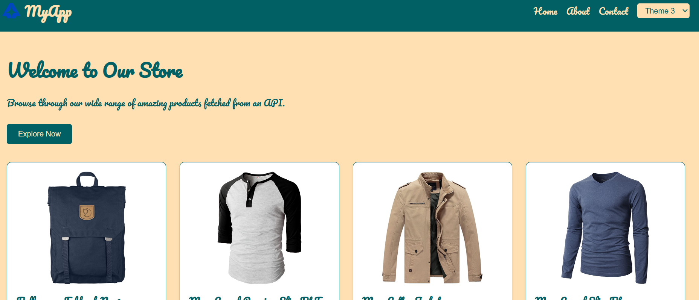
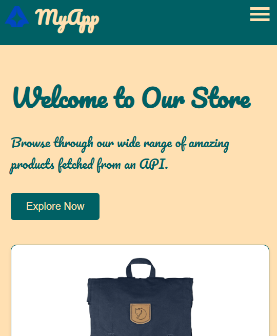
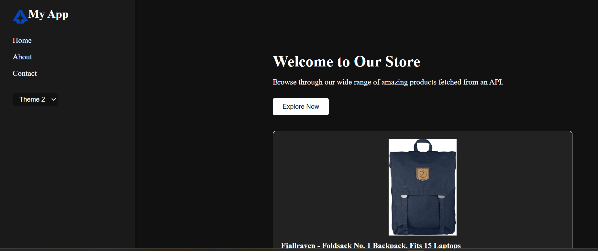
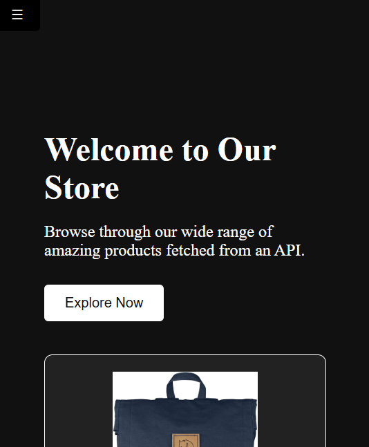
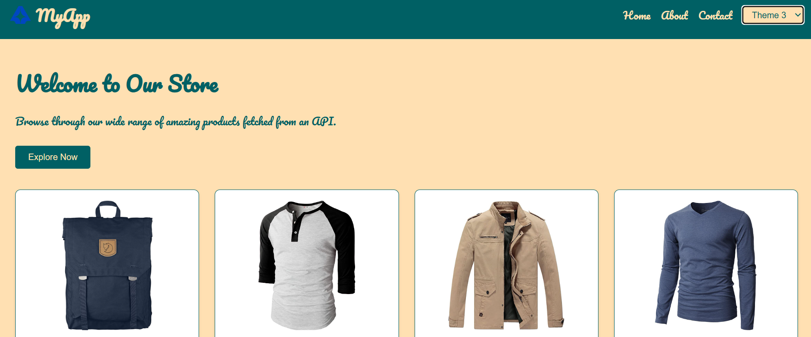

# 🎨 React Multi-Theme Switcher App

This is a responsive React application with support for multiple themes (Light, Dark, Custom). It uses Context API for theme management, React Router for page navigation, and is fully mobile-friendly.

## 🚀 Live Demo
[dazzling-quokka-54778b.netlify.app](https://dazzling-quokka-54778b.netlify.app/)]

---

## 📸 Preview

| Desktop View | Mobile View |
|--------------|-------------|
|  |  |
|  |  |
|  |  


---

## ✨ Features

- ✅ Light / Dark / Custom themes
- ✅ Theme persistence using `localStorage`
- ✅ Responsive layout (Header / Sidebar)
- ✅ Mobile-friendly hamburger menu
- ✅ React Router pages (Home, About, Contact)
- ✅ Theme selector dropdown

---

## 🧪 Test Credentials (Optional)

_N/A – No authentication required. This is a public UI demo._

---

## 🛠️ Tech Stack

- ⚛️ React JS
- 🎨 Tailwind CSS (or styled-components)
- 🧠 Context API
- 📦 React Router
- 💾 localStorage

---

## 📁 Folder Structure


---

## 🚀 Getting Started

1. Clone the Repo

```bash
git clone https://github.com/your-username/react-theme-switcher.git
cd react-theme-switcher


2. Install Dependencies

npm install

3. Start the App

npm run dev
Open http://localhost:5173 to view the app.


Author

---

:
-`Fahadbsc`
- **`[dazzling-quokka-54778b.netlify.app](https://dazzling-quokka-54778b.netlify.app/)]`
-`Fahad F`

---


